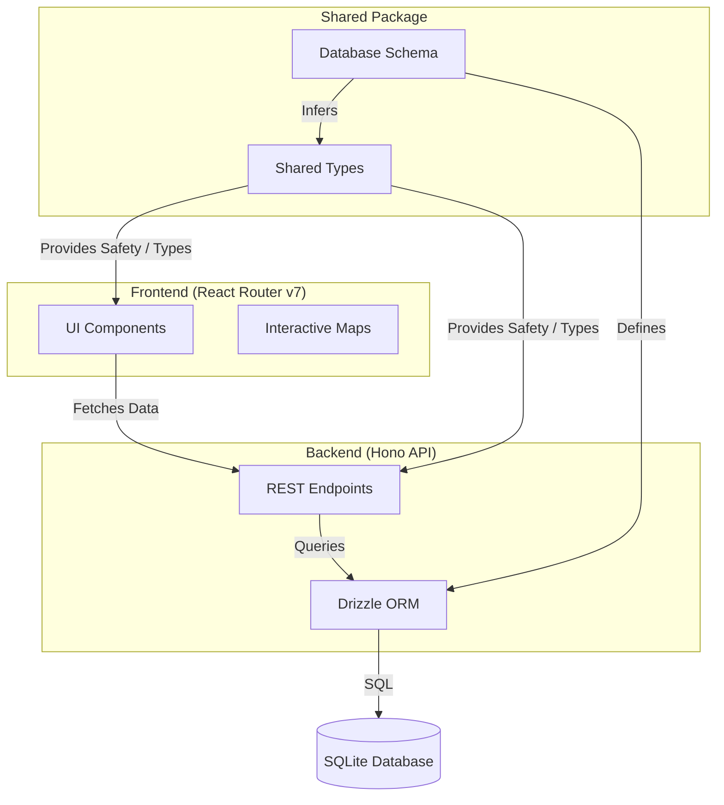

# Free Real Estate Monorepo

> [!NOTE]
> This project is under active development.

Real Estate company demo website and testing ground for numerous backends.

So far, I am working with Drizzle and SQLite, although I expect to use Prisma and MongoDB, and Golang too.

This present document serves as a General Design Document.

## 1. Project Structure

The project is structured as a **monorepo** managed by `pnpm` workspaces. This approach allows for tight integration between the frontend, backend and shared resources while maintaining a certain level of organizational boundaries.

A general overview of the current state of the project:



The main parts of this monorepo are as follows (dependencies and their web links are listed in their respective README documents):

### 1.1 Frontend

#### 1.1.1 Framework

The frontend is designed to be a high-performance, modern web application built with `React Router v7` (in _SPA_ mode).

It was decided to organize `React` components simply in `/frontend/app/components/`.

#### 1.1.2 Styling

With `Tailwind CSS v4` We utilize a custom theme and general reset that extends `preflight` along with utility classes.

#### 1.1.3 Maps

`React-leaflet` is used for interactive property maps that support adding markers. These are basically `open street maps` with some extra functionality.

#### 1.1.4 State Management

React Router's `loader` and `action` patterns are used for data fetching and mutations, minimizing the need for complex global state libraries

#### 1.1.5 Previews of the frontend:


---


---


### 1.2 Backends

#### 1.2.1 Drizzle

RESTful API built with `Hono`, using `Drizzle` ORM.

The runtime is `Node.js` via `@hono/node-server`.

- **Endpoints**:
  - `GET /api/properties`: Supports advanced filtering (price, type, location, etcetera).
  - `GET /api/properties/:id`: Detailed view of a single listing.
  - `GET /api/cities`: Utility to fetch unique cities for search suggestions on user inputs.
  - `GET /api/users` & `GET /api/posts`: Generic resource fetching.

##### 1.2.1.1 Core Database Entities

- **Users**: Represents real estate agents and their clients. It stores identity and profile information.
- **Properties**: The central entity. It stores listing details, location (latitude/longitude), pricing and media (images, galleries).
- **Posts**: Blog or news entries for the platform.
- **Chats & Messages**: Support for real-time and persistent communication between users.
- **Bookmarks**: Users are able to save favorite properties to look up later from their respective profile pages.

##### 1.2.1.2 Schema Implementation

We use `Drizzle`.

JSON fields are used to store complex data like image galleries and nearby places within the SQLite database without requiring a whole new set of tables. There is a neat helper for this thanks to Drizzle's custom types.

### 1.3 Shared

A central package containing the database schema and TypeScript types, ensuring consistency across both aforementioned sub-repositories as the single source of truth; these are shared as a local dependency under the name of `@free-real-estate/shared`.

## 2. Running the Project

As of now, one could clone the repository and run:

```bash
pnpm install

pnpm push:be && pnpm seed:be && pnpm run dev
```

**⌃** This:

1. Creates database tables according to the [schema](/shared/src/schema.ts).
2. Seeds the tables, for which you want to be using a Linux (or Unix) filesystem or check the **linked** [general data file](/backends/node-drizzle/src/db/generalDataSeed.ts) for compatibility with a different type of which.
3. To then start both the backend and frontend servers in parallel. Consult the [main package file](/package.json) for more commands to run from the root of the project.

## 3. Future Considerations

- **Authentication**: Implementation of it.
- **Image Hosting**: Transitioning from local assets to a CDN or cloud storage for the sake of integrating it.
- **Backend Diversification**: Implementing the same API specifications in Go to compare performance and developer experience could be very interesting from a certain perspective.
